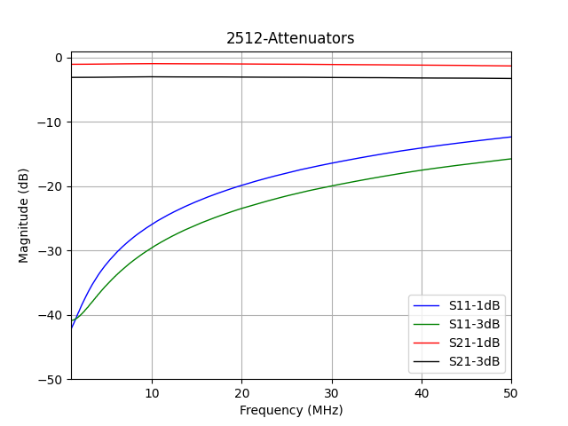
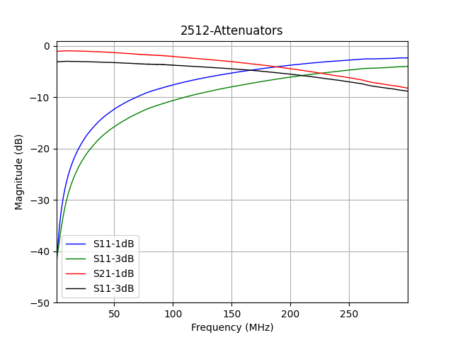

# 2512-attenuator
RF-attenuator from 1W 2512 size resistors with both BNC and SMA connectors. Works OK from DC to 30MHz. 

Measured with NanoVNA-H4 using NanoVNA saver.

---

## PCB Specs

PCB size: 71.5 x  25 x 1.6 mm

PCB Stackup: Two layer FR-4 (No impedance control) 

Traces are not 50 ohm as this is mainly for < 50 MHz use and the size of the entire PCB is thus significantly smaller than the wavelength at this frequency. 

I tried to only use resistors from the E12 series as much as possible.

Two parallel resistors are used for each position for increased thermal handling and to achieve a resistance closer to the calculated values.

---

## Heat Sink

Made to fit the following heat sink. 

> Heat Sink, 4.4 °C/W, TO-218, TO-220, TO-247, 42 mm, 38.1 mm, 25 mm

> Farnell Order code 1710612

---

## Design Notes

* Schematic is in the `plots` folder.
* [Link to RF Attenuator calculator](https://leleivre.com/rf_pipad.html)
* [Link to Parallel Resistor calculator](https://jansson.us/resistors.html)

Connections:
* `R1//R2//R3//R4` (input side, to ground)
* `R5//R6` (top of Pi network)
* `R7//R8//R9//R10` (output side, to ground)

---

## Resistor Values for Various Attenuators

| Resistor | Value for 1dB Attenuator | Value for 2dB Attenuator | Value for 3dB Attenuator | Value for 6dB Attenuator | Value for 10dB Attenuator | Value for 30dB Attenuator |
|----------|--------------------------|--------------------------|--------------------------|--------------------------|---------------------------|---------------------------|
| R1       | DNI                      | DNI                      | DNI                      | DNI                      | DNI                       | DNI                       |
| R2       | 2k2                      | 820                      | 560                      | 270                      | 180                       | 820                       |
| R3       | DNI                      | DNI                      | DNI                      | DNI                      | DNI                       | DNI                       |
| R4       | 1k5                      | 1k                       | 560                      | 330                      | 220                       | 22k                       |
| R5       | 12                       | 22                       | 33                       | 68                       | 150                       | 56                        |
| R6       | 10                       | 24                       | 39                       | 82                       | 150                       | 1k                        |
| R7       | 2k2                      | 1k                       | 560                      | 270                      | 180                       | 820                       |
| R8       | 1k5                      | 820                      | 560                      | 330                      | 220                       | 22k                       |
| R9       | DNI                      | DNI                      | DNI                      | DNI                      | DNI                       | DNI                       |
| R10      | DNI                      | DNI                      | DNI                      | DNI                      | DNI                       | DNI                       |

DNI = Do Not Install
